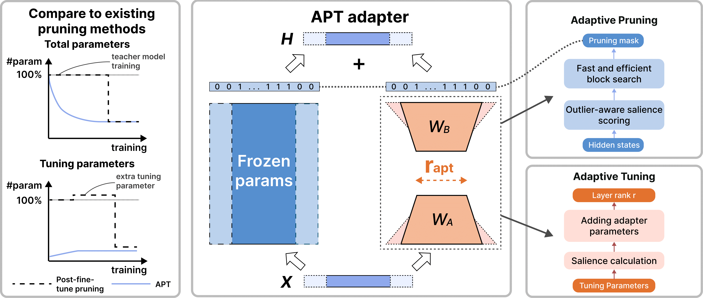

# APT
APT: Adaptive Pruning and Tuning Pretrained Language Models for Efficient Training and Inference

## News
- [2024/01/22] Our paper is now on arXiv! Check it out [here](https://arxiv.org/abs/2401.12200).
- [2024/05/01] [APT](https://arxiv.org/abs/2401.12200) is accepted by ICML 2024 as **oral presentation**!

## Overview

We propose APT, a methodology that **A**daptively selects model parameters for **P**runing and fine-**T**uning. APT combines the benefits of PEFT and structured pruning to make fine-tuning and inference more efficient. 

### How APT Works
Our intuition is that pretrained language model (LM) parameters contain general knowledge, but their importance to downstream tasks varies. Therefore, we can remove the parameters irrelevant to the fine-tuning task in the early training stage. Early-removing these parameters improves training and inference efficiency while not substantially hurting model accuracy. Meanwhile, continuously adding more parameters for fine-tuning can improve LM performance because task-specific skills live in a subset of LM parameters.

Based on this setup, we find that using **self-distillation** where the main parameters between the teacher and student models are shared can vasly prune small LMs with high end-task performance retained. Meanwhile, considering **in-block outliers by calculating kurtosis** when pruning large LMs before training can accurately prune them with less training memory footprint. 

### Main Results
RoBERTa-base experiment results:

| Method             | MNLI | SST2 | SQuAD v2 | Train Time | Train Mem.| Inf Time | Inf Mem.|
|--------------------|-----:|-----:|---------:|-----------:|----------:|---------:|--------:|
| FT                 | 87.6 | 94.8 |     82.9 |     100.0% |    100.0% |   100.0% |  100.0% |
| LoRA               | 87.5 | 95.1 |     83.0 |    2137.0% |     60.5% |   100.0% |  100.0% |
| LoRA+Prune         | 84.0 | 93.0 |     79.2 |    5128.3% |     **60.5%** |    **38.0%** |   **75.1%** |
| Prune+Distill      | 87.3 | **94.5** |        - |    1495.3% |    168.5% |    38.6% |   79.2% |
| LoRA+Prune+Distill | 84.2 | 91.9 |        - |    6534.6% |    141.4% |    39.4% |   82.3% |
| APT                | **86.4** | **94.5** |     **81.8** |     **592.1%** |     70.1% |    41.3% |   78.1% |

T5-base experiment results:
| Method     |     MNLI |     SST2 |             CNN/DM | Train Time | Train Mem.|  Inf Time |  Inf Mem. |
|------------|---------:|---------:|-------------------:|-----------:|----------:|----------:|----------:|
| FT         |     87.1 |     95.2 |     42.1/20.3/39.4 |     100.0% |    100.0% |    100.0% |    100.0% |
| LoRA       |     87.0 |     95.0 |     38.7/17.2/36.0 |     255.5% |     62.0% |    100.0% |    100.0% |
| LoRA+Prune |     80.9 |     92.3 |     36.7/15.7/33.9 |    4523.5% | **62.0%** | **47.1%** | **73.4%** |
| APT        | **87.0** | **95.0** | **38.6/17.0/35.8** | **484.7%** |     73.9% |     74.6% |     81.5% |

LLaMA-7B experiment results:
| Method     |      ARC | HellaSwag |   MMLU | TruthfulQA |     Avg. | Train Time | Train Mem. |   Inf Time |   Inf Mem. |
|------------|---------:|----------:|---------:|-----------:|---------:|-----------:|----------:|-----------:|----------:|
| LLaMA 2 7B |     53.1 |      77.7 |     43.8 |       39.0 |     53.4 |          - |         - |          - |         - |
| LoRA       |     55.6 |      79.3 |     46.9 |       49.9 |     57.9 |     100.0% |    100.0% |     100.0% |    100.0% |
| LoRA+Prune | **46.8** |      65.2 |     23.9 |       46.2 |     45.5 |     180.9% |    100.0% |     115.5% |     68.9% |
| LLMPruner  |     39.2 |      67.0 |     24.9 |       40.6 |     42.9 |  **86.9%** |    253.6% | **114.8%** |     74.2% |
| APT        |     45.4 |  **71.1** | **36.9** |   **46.6** | **50.0** |     106.0% | **75.8%** |     117.0% | **67.2%** |

## Setup

### Installation
```bash
conda env create -f environment.yml
conda activate apt
```

### Training
For finetuning RoBERTa-base models with APT, please run:
```bash
bash scripts/adaptpruning/roberta_base_sst2_momentum.sh
```

For finetuning T5-base models with APT, please run:
```bash
bash scripts/adaptpruning/t5_base_lm_adapt_cnndm_momentum.sh
```

For finetuning LLaMA2 models on Alpaca with APT, please run:
```bash
bash scripts/adaptpruning/llama_2_7b_alpaca_gpt4.sh
```

## Citation
If you use this code or our tuned models, please cite our paper:
```
@misc{zhao2024apt,
      title={APT: Adaptive Pruning and Tuning Pretrained Language Models for Efficient Training and Inference}, 
      author={Bowen Zhao and Hannaneh Hajishirzi and Qingqing Cao},
      year={2024},
      eprint={2401.12200},
      archivePrefix={arXiv},
      primaryClass={cs.CL}
}
```

## Acknowledgements
This project uses modified code from the following projects:
- [CoFiPruning](https://github.com/princeton-nlp/CoFiPruning): developed by Princeton-nlp. Model backbone codes reused for pruning BERT and RoBERTa. See `models/modeling_bert.py` and `models/modeling_roberta.py`.
- [Mask Tuning](https://github.com/WoosukKwon/retraining-free-pruning): developed by Woosuk Kwon. We use the codes as a baseline to prune the post-training LMs. See `prune/fisher.py`.